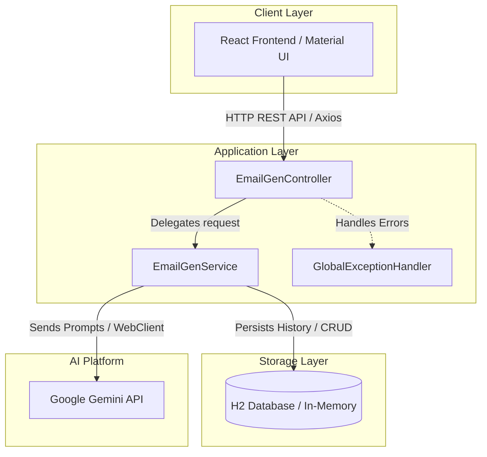

# ✉️ Umang's AI Email Reply Generator (React + Spring Boot + Gemini API + Docker)


An enterprise-ready, AI-powered email assistant that automatically generates tailored, context-aware replies. Users can paste an incoming email, customize the tone, length, and language, provide key reply points, and manage their reply history.

---

## 🏗️ System Architecture



---

## 🚀 Key Features

* **AI-Generated Replies**: Leverages Google Gemini Pro / Flash models to generate intelligent email replies.
* **Customization Filters**:
  * **Tones**: Professional 👔, Casual ☕, Friendly 😊, Urgent 🚨, Apologetic 🙏.
  * **Lengths**: Short (1-2 sentences), Medium (1-2 paragraphs), Long (detailed response).
  * **Languages**: English, Spanish, French, German, Hindi.
* **Smart Prompt Tuning**: Accepts custom key instructions (e.g., "accept the invitation, ask for price") to align the reply.
* **Local Persistence**: Saves generated replies and prompt settings into an H2 database.
* **Saved History Dashboard**: Slide-out history panel to load previous replies back into the form or delete them.
* **Robust Error Handling**: Standardized REST error payloads via `@RestControllerAdvice`.
* **Docker Orchestration**: Simple one-command deployment for both frontend and backend services.

---

## 🛠️ Tech Stack

| Tier | Technology | Description |
|---|---|---|
| **Frontend** | React, Material UI, Axios, Vite | Interactive dark-themed UI |
| **Backend** | Java 21, Spring Boot 3.4.5, Spring Data JPA | Scalable REST API backend |
| **Database** | H2 Database | In-memory persistence for reply logs |
| **HTTP Client** | Spring WebClient | Non-blocking reactive HTTP calls |
| **AI Integration** | Google Gemini API | Natural Language Processing |
| **DevOps** | Docker, Docker Compose | Self-contained, multi-stage containers |

---

## 📂 API Specifications

### 1. Generate Email Reply
* **Endpoint**: `POST /api/email/generate`
* **Request Body**:
```json
{
  "emailContent": "Can you attend the meeting tomorrow at 10 AM?",
  "tone": "Professional",
  "length": "Short",
  "language": "English",
  "customContext": "Say yes but I will be 10 minutes late"
}
```
* **Response**: `String` (The generated email reply text body).

---

### 2. Fetch Generation History
* **Endpoint**: `GET /api/email/history`
* **Response**: `200 OK`
```json
[
  {
    "id": 1,
    "emailContent": "Can you attend the meeting...",
    "tone": "Professional",
    "length": "Short",
    "language": "English",
    "customContext": "Say yes...",
    "generatedReply": "Hi team, Yes, I will attend. I'll be about 10 minutes late. Thanks!",
    "createdAt": "2026-06-14T18:50:00"
  }
]
```

---

### 3. Delete History Record
* **Endpoint**: `DELETE /api/email/history/{id}`
* **Response**: `204 No Content`

---

## ⚙️ Setup and Installation

### Prerequisites
* **Java 21**
* **Node.js** (v18+)
* **Google Gemini API Key** ([Get it from Google AI Studio](https://aistudio.google.com/))

### Method 1: Local Development

#### 1. Backend Setup
1. Set your environment variables:
   ```bash
   export GEMINI_URL="https://generativelanguage.googleapis.com/v1beta/models/gemini-2.5-flash:generateContent?key="
   export GEMINI_KEY="YOUR_GEMINI_API_KEY_HERE"
   ```
2. Navigate to the backend directory and launch the server:
   ```bash
   cd reply-generator
   ./mvnw spring-boot:run
   ```
3. The server will run at `http://localhost:8080`.
4. Access H2 Console at `http://localhost:8080/h2-console` (JDBC URL: `jdbc:h2:mem:emaildb`, User: `sa`, Password: ``).

#### 2. Frontend Setup
1. Navigate to the frontend directory:
   ```bash
   cd email-writer-react
   npm install
   npm run dev
   ```
2. Open your browser to `http://localhost:5173`.

---

### Method 2: Docker Compose (Unified Run)

Spin up the entire application (including backend compilation and frontend build) using Docker Compose:

1. Create a `.env` file in the root directory:
   ```env
   GEMINI_KEY=YOUR_GEMINI_API_KEY_HERE
   ```
2. Launch containers:
   ```bash
   docker compose up --build
   ```
3. Open:
   * **Frontend**: `http://localhost:3000`
   * **Backend**: `http://localhost:8080`

---

## 👤 Developer Details

* **Name**: Umang Shukla
* **Email**: [shuklaumang012@gmail.com](mailto:shuklaumang012@gmail.com)
* **GitHub**: [github.com/umangshukla10](https://github.com/umangshukla10)
